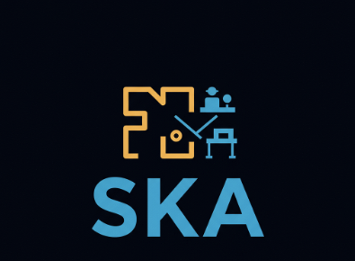
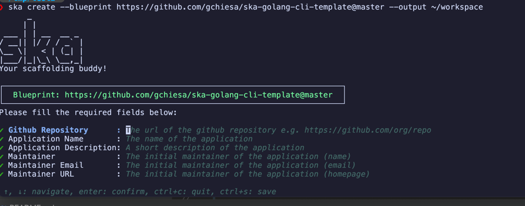

<h1 align="center">
  
  <br/>
  SKA
</h1>
<h4 align="center">Your scaffolding buddy!</h4>
<hr/>
<p align="center">
  <a href="https://pkg.go.dev/github.com/gchiesa/ska"></a> <a href="https://github.com/gchiesa/ska/actions/workflows/go-ci-lint.yaml"></a> <a href="https://github.com/gchiesa/ska/actions/workflows/go-ci-test.yaml"></a> <a href="https://goreportcard.com/report/github.com/gchiesa/ska"></a> <a href="https://github.com/gchiesa/ska/network/dependents"></a>
</p>


SKA is a "skaffolding" tool that allows you to expand folders based on local or remote blueprint templates (GitHub and
GitLab hosted or local filesystem).

## Yet another templating tool?

Yes, probably, but SKA includes some features that make it special:

### Dynamic form for capturing data

Each blueprint supports the `.ska-upstream.yaml` file which is the definition of the variables which can be used to
expand the template. For each variable you can define multiple aspects, and this information is used by SKA to
dynamically create an interactive form to capture the data.




### Central management for template update rollouts

Typically, scaffolding tools offer a one-shot code generation. After that the code is autonomous, and there is no
possibility to centrally onboard new changes.

**SKA is different here**: once the initial scaffolding is generated, you can always update it by changing the values in
the
interactive form. If your central team created a new version of the template, you can also switch to the new version
and onboard the centrally manages addition/modifications to the templates.


### Support for partial updates on templates

In SKA, you can update only part of the initially created template. This is done via special tags you need to use as
comment in your code.
With the support for partial updates, you can keep only a specific part of the file centrally managed by the upstream
blueprint and let the user change the rest of the file.

> [!TIP]  
> To configure SKA to update only partial portions of the file introduce a comment in your code with
> the `ska-start:<identifier>` and `ska-end` to identify the partial section

<details>
<summary>Example with `codecov.yaml`</summary>

In this example on each update only the section enclosed in `ska-start/end` will be updated.

```yaml
---
coverage:
  status:
    project:
      # ska-start:default-codecov-project
      default:
        target: auto
        threshold: 5%
      # ska-end
    patch:
      # ska-start:default-codecov-patch
      default:
        target: 50%
        threshold: 5%
      # ska-end 
ignore:
- "cmd/man.go"
```

</details>

## SKA in action

In the simple demo below you can see how SKA works. In the first step you can see the initial scaffolding. In the second
step you can see the interactive form to capture the data. In the third step you can see the final result and how
you can update a file partially managed by SKA.


## Get Started with SKA

SKA is distributed via [Homebrew](https://brew.sh/), so you can install it with the commands below:

```shell
brew tap gchiesa/ska
brew install ska
```

## How To Use

SKA is straightforward to use. Just run `create` with the upstream blueprint you want to use. See the below example for
scaffolding a golang command line tool:

```shell
ska create --blueprint https://github.com/gchiesa/ska-golang-cli-template@master --output ~/workspace/myNewApp
```

This will load the remote template, collect the required variable via Terminal UI and create the project for you.

In the root of the project you can find the SKA configuration folder `.ska-config/ ` that will keep track of state and
upstream reference.

When you want to update your project, use:

```shell
cd ~/workspace/myNewApp
ska update --path .
```

You can modify the variables or accept the current version. Your project will be updated based on the latest changes in
the upstream blueprint.

More information is available with `ska --help`.

<!-- TODO -->

## Example use cases

The following links are examples of how you can use SKA in various common use cases:

* [central repository with multiple templates in subfolders](docs-md/use-case-multiple-template-subfolders.md)

* [centrally maintain only a part of a file](docs-md/use-case-partial-management.md)

* [ignore files after 1st templating](docs-md/use-case-ignore-files-after-1st.md)

* [manage multiple ska templates in the same folder](docs-md/use-case-manage-multiple-templates-same-folder.md)

## Integrate SKA in your project

SKA is designed for simplicity and quick usage. If you want to integrate SKA capabilities in your app or framework,
you can leverage the package under `pkg/`.

## Concepts and Templating

### Upstream Blueprint

This is the typically centrally maintained template that everyone can use to expand its own folder structure. You
can specify the blueprint both locally and remotely with specific URIs:

* **file://** for local blueprints. E.g. `file:///Users/gchiesa/git/ska-example-template`
* **https://** for GitHub or GitLab blueprints. You can optionally pin a specific reference (tag or branch with
  the `@`)
  symbol. E.g. `https://github.com/gchiesa/ska-example-template@v1.2.3`

> [!NOTE]
> You can also pin subfolders with the format: https://github.com/ORG/REPO//path/to/template@ref

### Update from upstream

Whenever the upstream template changes, you might want to onboard the changes yourself. SKA natively supports this, by
offering a simple `update` command with not additional arguments required.

See the "How To Use" section for more information.

### Upstream Template Language

SKA currently fully supports **[Go Template framework][go-template]** for templating your upstream blueprint.

Moreover, in addition to Go Template you can use the extensions offered by [Sprig functions][sprig]

If you are not familiar with Go Template have a look to this [simple how-to][go-template-how-to].

> [!NOTE]
> SKA supports also a Jinja2 like engine (use the `--engine jinja` argument) that will make your life easier
> when you need to deal with native go code. However, the function set is limited. The support is based on [Pongo2
> project][pongo2].


[go-template]: https://pkg.go.dev/text/template

[sprig]: https://masterminds.github.io/sprig/

[go-template-how-to]: https://www.digitalocean.com/community/tutorials/how-to-use-templates-in-go#step-4-writing-a-template

[pongo2]: https://www.schlachter.tech/solutions/pongo2-template-engine/

### Templating with partial sections

SKA offers the ability to manage only part of files.
This is generally useful to keep only a specific part of the file centrally managed by the upstream blueprint and
let the user change the rest of the file. See as example
the `codecov.yml` [here](https://github.com/gchiesa/ska-golang-cli-template/blob/master/codecov.yml)

This is achievable with the named partials, a type of block you can use in the SKA template.

For example, if we want to have only a section of a larger file managed by SKA we can use the approach below:

```yaml
# this is an example YAML and we want SKA to only manage the section `key4`
---
root:
  key1: value1
  key2: {{.notManaged}}
  key3: value3
  # ska-start:key/4
  key4:
    subkey: "{{.appName}}"
    subkey2: value2
  # ska-end
  key5: value5
```

by using the `ska-start:<blockName>` and `ska-end` tags, you instruct SKA to only process the block and leave the
rest of the file as it is.

This is quite useful for files where only a part should be centrally managed and the rest will be customized by the
user, after the initial creation.


### Template variable collection via Terminal UI

While developing the blueprint, you can configure SKA to collect the variables via Terminal UI.

To do this, you need to create on the root of your blueprint folder a special file `.ska-upstream.yaml`. The file is a
simple YAML file with the following structure (see example with comments):

```yaml
# list of path that will be ignored in the blueprint
# typically it's wise to ignore `.git` and `.idea` (and your preferred IDE) since you might use
# the blueprint not only from remote but also from your local filesystem
ignorePaths:
- .git
- .idea

# list of path (can be templated) that will be pre-populated in the final ska-config
skaConfig:
  ignorePaths:
  - "idea/*"
  - test-file-to-be-ignored-{{.testFileName}}.txt
  - "*.ignored"

# this is the section that SKA will consume to generate the input form.
# each input supports the following information:
#
# * placeholder: the name of the variable you used in the template blueprint
# * label: the label used in the form
# * help: the help inline to be presented in the form for that specific field
# * regexp: a validation regexp that will be used to specify the set of accepted characters (NOT A ENTIRE PATTERN VALIDATION)
# * default: the default value you might want to present in the form
inputs:
- placeholder: githubRepo
  label: Github Repository
  help: The url of the github repository e.g. https://github.com/org/repo
  regexp: "^[a-z0-9-/:.]*$"

# ... other inputs
```

SKA will check if the file is present, and if yes, then a Terminal UI interface will be used to collect the inputs.

The interactive Terminal UI can be disabled with `--non-interactive (-n)` command line argument.


### Example template

Check this example golang cli tool template: https://github.com/gchiesa/ska-golang-cli-template

## Contribute

You are more than welcome! please have a look at [CONTRIBUTING.md](CONTRIBUTING.md)

## Credits

SKA is made with 💙 and attention for good platform engineering practices, by Giuseppe Chiesa.
